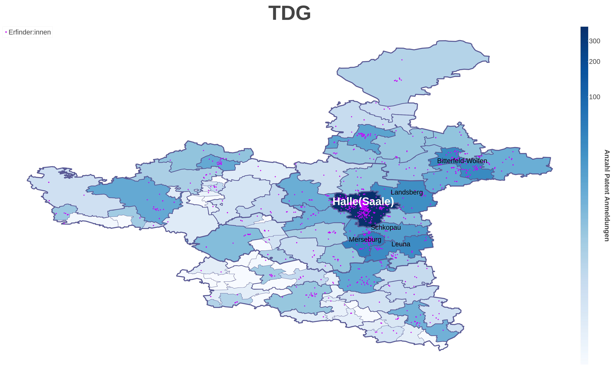

# WIR Kompetenz-Landkarten



### Getting started

To begin generating the plots first install the requirements.txt 

```bash
pip install requirements.txt
```

Next you need to query your *Patstat* database (not done in this repo). 
The PGSQL queries we used were the following: 

**query only inventors** 
```sql
SELECT * FROM
	(SELECT * FROM
	(SELECT * FROM
	(SELECT * FROM 
	public.tls207_pers_appln t207
	INNER JOIN public.tls206_person t206 
	ON t207.person_id = t206.person_id
	WHERE  person_ctry_code = 'DE' and person_address != '') deutsche_erfi
	
	INNER JOIN public.tls201_appln t201
	ON t201.appln_id = deutsche_erfi.appln_id) de_mit_family_id
	
	INNER JOIN 
	(SELECT DISTINCT ON (docdb_family_id)
        docdb_family_id,
        cpc_class_symbol FROM public.tls225_docdb_fam_cpc
    WHERE cpc_position = 'F') t225
	ON de_mit_family_id.doc_db_family_id = t225.docdb_family_id) dp_cpc
	WHERE invt_seq_nr != 0 
```

**query inventors and applicants** 
```sql
SELECT * FROM
	(SELECT * FROM
	(SELECT * FROM
	(SELECT * FROM 
	public.tls207_pers_appln t207
	INNER JOIN public.tls206_person t206 
	ON t207.person_id = t206.person_id
	WHERE  person_ctry_code = 'DE' and person_address != '') deutsche_erfi
	
	INNER JOIN public.tls201_appln t201
	ON t201.appln_id = deutsche_erfi.appln_id) de_mit_family_id
	
	INNER JOIN 
	(SELECT DISTINCT ON (docdb_family_id)
        docdb_family_id,
        cpc_class_symbol FROM public.tls225_docdb_fam_cpc
    WHERE cpc_position = 'F') t225
	ON de_mit_family_id.doc_db_family_id = t225.docdb_family_id) dp_cpc
```


**query to generate nace2 appln_id table**
```sql
SELECT * FROM
	(SELECT appln_id as appln_id_de FROM
	public.tls207_pers_appln t207
	INNER JOIN public.tls206_person t206 ON t207.person_id = t206.person_id
	WHERE person_ctry_code = 'DE' and person_address != '') as de_appln_ids
	
	INNER JOIN public.tls229_appln_nace2 t229 ON de_appln_ids.appln_id_de = t229.appln_id
```

**Query to generate csv with all CPC classes**
```sql
SELECT DISTINCT de_mit_family_id.appln_id as appln_id,
       cpc_symbols.cpc_class_symbols
FROM
(
    SELECT deutsche_erfi.appln_id as de_appln_id, t201.*
    FROM
    (
        SELECT t206.*, t207.* 
        FROM 
        public.tls207_pers_appln t207
        INNER JOIN public.tls206_person t206 
        ON t207.person_id = t206.person_id
        WHERE person_ctry_code = 'DE' AND person_address != ''
    ) deutsche_erfi
    INNER JOIN public.tls201_appln t201
    ON t201.appln_id = deutsche_erfi.appln_id
) de_mit_family_id
LEFT JOIN 
(
    SELECT appln_id, array_agg(cpc_class_symbol) AS cpc_class_symbols
    FROM public.tls224_appln_cpc
    GROUP BY appln_id
) cpc_symbols
ON de_mit_family_id.de_appln_id = cpc_symbols.appln_id;
```

Now add the Patstat Export csv to the `./data` folder and name it `data.csv`

Next download the *gadm* data for germany for level-0 to level4 as GeoJSON from 
`https://gadm.org/download_country.html`

Place all .json files in the `./data` folder. They should be named gadm41_DEU_\<level\>.json

Now you can run the following notebooks in the following order to generate the plots: 

1. *Splitting Data on Regions.ipynb*
2. *Address to Coordinate.ipynb*
3. *Plots.ipynb*
